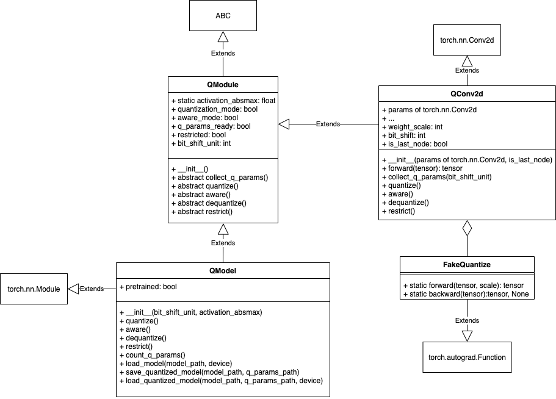

========================================================================
ANN量化框架
========================================================================

本文档作者：曲环宇

半自动量化框架的目标是提供一系列接口，用户需要使用这些接口在神经网络框架(如PyTorch)中重写模型，重写后的模型的量化可以通过调用一些提供的方法自动完成。

实现一个自动量化框架目前想到的有两条路线：

1. 先将神经网络框架中写好的模型转成算子图(如ONNX)，通过算子图加入量化信息，由于量化的过程需要进行训练，所以或者将算子图重新转换成python代码在神经网络框架中进行训练，或者需要一个支持加入量化信息的算子图的后端训练引擎，这两种方法实现起来的工程难度都比较大，但相对的自动化程度更高

2. (文档中采用的方案)重写PyTorch中的一些基类，为这些类补充量化信息，用户需要借助这些提供的接口重写模型，重写的主要原因是量化需要处理的操作包括卷积、全连接、加法、AveragePool等，一些操作例如卷积、AveragePool等可以自动识别并进行替换成带有量化信息的对应类，而类似于加法一类的操作并不是torch.nn.Module(只是一个+号)，对这种操作的识别并不是直接能完成的(需要进行词法分析之类的)，所以让用户自己手动替换更容易实现。

基本原理
########################################

量化的基本原理
************************************

这里对量化的基本原理进行简单的介绍，详见 [1]_ [2]_ [3]_ 。假设整数\ :math:`Q \in [A, B]`\ ，浮点数\ :math:`x \in [a, b]`\ ，再假设\ :math:`Q`\ 和\ :math:`x`\ 的区间分布都是对称的，可记为\ :math:`Q \in [-Q_m, Q_m]`\ ，\ :math:`x \in [-x_m, x_m]`\ ，我们想建立一种\ :math:`Q`\ 到\ :math:`x`\ 的映射：

.. math::

   x = S_Q Q

一种简单的确定\ :math:`S_Q`\ 的方法就是保证\ :math:`Q_m`\ 被映射到\ :math:`x_m`\ (这个领域有很多研究，其中一种行业常用的方法 [2]_ 由NVIDIA提出)，即\ :math:`S_Q = x_m / Q_m`.
在一般的神经网络中，权重和激活的分布都接近于正态分布或Laplace分布，所以我们可以假设浮点数\ :math:`x`\ 分布在一个对称区间，再假设我们量化后模型的精度为INT8，可得\ :math:`S_Q = x_m / 128`\ 。由此可得，把一个权重或一层激活值中的浮点数映射到INT8整数可由下式得到：

.. math::

   Q = {\rm round}(128 x / x_m).{\rm clamp}(-128, 127)

考虑神经网络中常见的乘累加操作：

.. math::

   \begin{equation}
   y = \sum w x + b
   \end{equation}

权重、偏置、激活都有对应的不同的浮点数到整数的映射：

.. math::

   y = S_Y Y

.. math::

   w = S_W W

.. math::

   x = S_X X

.. math::

   b = S_B B

将这4个等式带入(1)可得：

.. math::

   S_Y Y = \sum S_W W S_X X + S_B B

即：

.. math::

   \begin{equation}
   Y = \frac{S_W S_X}{S_Y} (\sum W X + \frac{S_B}{S_W S_X} B)
   \end{equation}

令\ :math:`B' = b / (S_W S_X)`\ ，(2)式变为

.. math::

   \begin{equation}
   Y = \frac{S_W S_X}{S_Y} (\sum W X + B')
   \end{equation}

其中偏置和乘累加和一般用INT32精度存储，通过乘一个系数\ :math:`\alpha = S_W S_X / S_Y`\ 转为INT8整数，这个INT8的整数可继续进行下一个乘累加的操作。

按照Google在 [1]_ 中的研究结果，系数\ :math:`\alpha \in (0, 1)`\ ，乘一个0到1之间的浮点数的操作在硬件上一般通过：

1. 计算\ :math:`{\rm round}(2^{n} \times \alpha)`\ ，\ :math:`n`\ 为硬件可选的参数
2. 计算\ :math:`{\rm round}(2^{n} \times \alpha) \times (\sum W X + B')`\ ，硬件需要支持n-bit无符号数和INT32的乘法
3. 将2中得到的计算结果右移\ :math:`n`\ 位，得到最终的INT8结果

综上，对卷积和全连接等操作的量化推理需要硬件支持INT8的乘法，INT32的加法，n-bit无符号数和INT32的乘法和移位操作，其中n的值越大，计算的精度就越高。

另有一类需要量化过程中进行特殊处理的是加法操作，考虑：

.. math::

   c = a + b

.. math::

   c = S_C C

.. math::

   a = S_A A

.. math::

   b = S_B B

则有：

.. math::

   S_C C = S_A A + S_B B

即：

.. math::

   C = \frac{S_A}{S_C} A + \frac{S_B}{S_C} B

加法的整数推理需要对\ :math:`A`\ 和\ :math:`B`\ 两个INT8的整数进行乘系数的操作，两个系数虽然不一定在0到1范围内，但处理方式和乘累加操作基本相同：

1.计算\ :math:`{\rm round}(2^{n} \times \alpha)`\ ，\ :math:`n`\ 为可选的参数，假设硬件支持INT32乘法，则需要保证\ :math:`{\rm round}(2^{n} \times \alpha) < 2^{31}`
2. 计算\ :math:`{\rm round}(2^{n} \times \alpha) \times (\sum W X + B')`
3. 将2中得到的计算结果右移\ :math:`n`\ 位

AveragePool的处理与加法类似

.. math::

   y = \frac{x_1 + x_2 + ... + x_n}{n} 

.. math::

   y = S_Y Y

.. math::

   x = S_X X

则有：

.. math::

   Y = \frac{S_X(X_1 + X_2 + ... + X_n)}{nS_Y}

在完成累加后需要处理系数\ :math:`\alpha = S_X / nS_Y`\ ，或者硬件原语之间支持求均值的操作，这样\ :math:`\alpha = S_X / S_Y`\ ，此处不再赘述。

当然上面所有乘系数的操作也可以变成浮点数操作，会降低一些效率。

量化感知训练
************************************

尽管我们有上述的各种推导，但我们知道(1)式和(2)式并不是完全等价的，两者之间的差距来源于：

.. math::

   \begin{equation}
   Q = {\rm round}(x / S_Q).{\rm clamp}(-128, 127)
   \end{equation}

而并不是\ :math:`Q = x / S_Q`\ ，这导致后训练静态量化(即上一部分所述方法)后的模型不可能和浮点数模型的精度完全相同。在一些情况下，后训练静态量化得到的模型可能和浮点数模型有非常大的精度差距，而解决这个问题的技术就是量化感知训练。

所谓量化感知训练，就是在训练过程中引入量化误差的影响，再通过BP训练，使得模型可以“感知”到量化带来的误差，从而提高量化模型的精度。感知的方法就是对浮点数进行量化反量化(也称为伪量化)，从而将浮点数转换到与整数对应的离散等级上，同时对原浮点数的取值不产生大影响：

.. math::

   x' = S_Q ({\rm round}(x / S_Q).{\rm clamp}(-128, 127))

注意到伪量化的过程由于取整函数的存在，导致伪量化操作是不可导的，我们需要自定义这个操作的导数，常用的方法是使用Straight Through Estimator，即认为伪量化过程的梯度为1，相当于在反向传播的过程中把伪量化操作之后的梯度直接向前传播。

对特殊后端硬件的处理
************************************

我们注意到在量化推理的过程中，乘一个浮点数系数的过程是有比较大的代价的，可能会需要进行INT32乘法甚至是浮点数乘法，一些研究将乘一个浮点数系数的计算限制为只通过移位操作来实现，实际上就相当于将浮点数乘数限制为只能取\ :math:`1/2^n(n=0,1,...)`\ 。在这种情况下，硬件就只需要支持INT8乘法、INT32加法和移位操作，显然会变得更加高效，但相应的由于加入了更多的约束，量化后精度一般也会更低。

这里我们提出一种针对只有移位单元的硬件的简单的量化方法，方法实现起来非常简单，精度也在可接受范围内。我们仍考虑乘累加操作，当只有移位单元时，要求：

.. math::

   \begin{equation}
   \frac{S_W S_X}{S_Y} = \frac{1}{2^n}
   \end{equation}

如果我们能保证\ :math:`S_X = S_Y`\ ，就只需要\ :math:`S_W = 1 / 2^n`\ 即可满足(5)的要求，即只需要移位就可以完成乘浮点数的操作。反映在训练过程中，\ :math:`S_X = S_Y`\ 即要求\ :math:`x_m = y_m`\ ，可通过在训练过程中将输入输出的激活值限制在同一范围内实现，\ :math:`S_W = 1 / 2^n`\ 即要求\ :math:`w_m / 128 = 1 / 2^n`\ (假设权重为INT8精度)，一个训练好的模型中的\ :math:`w_m`\ 是确定的，我们可以令\ :math:`n = {\rm round}({\rm log}_2(128 / w_m))`\ ，并在训练过程中将权重限制在\ :math:`[-M, M]`\ 的范围，其中\ :math:`M = 128 / 2^{{\rm round}({\rm log}_2(128 / w_m))}`\ 。

此外，令\ :math:`S_X = S_Y`\ 也直接解决了加法和AveragePool的量化问题(如果AveragePool完成了求均值的操作)。

在对激活和权重的范围进行限制，并加入伪量化之后，我们就可以进行带特殊约束的量化感知训练，训练得到的浮点数模型再经过量化后就可以在只有移位单元的硬件上无精度损失的部署。

综上所述，量化是一个和硬件后端有一定相关程度的编译步骤，会受到硬件实现的制约。

上述方法完成量化的具体步骤如下：

1. 加载预训练模型
2. 将预训练模型中的BN和卷积融合
3. 将预训练模型所有的激活值限制在[-M, M]的范围内
4. 统计权重分布，确定量化参数，包括权重放缩系数和移位位数
5. 通过统计得到的量化参数对模型进行静态量化，如果静态量化后的精度符合预期，结束，否则进行6
6. 通过统计得到的量化参数对模型进行量化感知训练(下简称为QAT)，每个epoch的QAT结束后，对模型进行静态量化，如果静态量化后的精度符合预期，结束，否则迭代到最大epoch数后结束，返回精度最高的整数模型

下面对上述的一些步骤进行具体说明：

**步骤2**

这个步骤其实是转换部分的优化，这个优化能够显著降低量化的实现难度，即减少乘累加操作的数量，所以放到量化这里实现。

需要注意的是，我们只对可以融合的BN和卷积进行融合，即两个连续的算子之间不能有非线性操作，否则融合后结果不可能等价，例如Conv-ReLU-BN组合不可能被等价地转换成一个Conv。

**步骤3**

所有激活值限制到统一的范围满足了\ :math:`S_X = S_Y`\ 的条件，一般可以把激活值都限制到[-1, 1]的范围内。

**步骤4**

这一步是为了满足\ :math:`S_W = 1 / 2^n`\ 的要求，从而保证整个量化推理过程可以只通过INT8乘法、INT32加法和移位操作实现。

ANN量化框架实现
########################################

ANN量化框架基本使用流程
************************************

1. 重写类似于下面的模型：

.. code:: python

   import QModel, QConv2d

   class Model(QModel):
       def __init__(self):
           super(Model, self).__init__()
           self.conv = QConv2d(in_channels=3, out_channels=16, kernel_size=3)
       
       def forward(self, x):
           y = self.conv(x)
           return y

2. 

   -  创建模型，此时模型的功能与原浮点数模型完全相同，可直接在当前状态下进行浮点数模型的训练
   -  因为重写模型的属性名与原模型保持一致，如果已有预训练的浮点数模型，可直接调用\ ``torch.nn.Module``\ 的\ ``load_state_dict(model_path)``\ 函数加载预训练模型，本文档中将加载预训练模型的功能进行了封装，通过\ ``load_model(model_path, device)``\ 实现

3. 将模型中的Conv-BN融合成一个卷积计算

4. 调用\ ``restrict()``\ 方法，对\ ``QModel``\ 进行重训练，此时前向过程的所有激活值都会被clamp到\ ``[-activation_absmax, activation_absmax]``\ ，其中\ ``activation_absmax``\ 可在创建\ ``QModel``\ 时指定，默认值为1，clamp的操作在\ ``QConv2d``\ 等算子的\ ``forward()``\ 函数中自动实现；训练过程中需要对输入进行处理，保证输入的范围也满足对激活的限制，假设输入为\ ``x``\ ，一般可对输入采取如下操作：

.. code:: python

   x = x / (x.abs().max()) * activation_absmax

5. 加载重训练后的\ ``QModel``
6. 调用\ ``QModel``\ 中的\ ``count_q_params()``\ 方法统计量化参数
7. 调用\ ``quantize()``\ 方法将\ ``QModel``\ 置于量化模式，\ ``quantize()``\ 方法会调用\ ``QModel``\ 的所有实例化\ ``QModule``\ 的属性的\ ``quantize()``\ 方法
8. 对\ ``QModel``\ 进行正常的前向推理，得到静态量化的测试精度；前向推理时需要对输入进行量化，假设输入为\ ``x``\ ，一般对输入采取如下方式进行量化：

.. code:: python

   x = (x / x.abs().max()).round().clamp(-128, 127)

9.  如果静态量化的测试精度达到需求，调用\ ``save_quantized_model(model_path, q_params_path)``\ 方法保存量化模型(.pth文件)和量化参数(.npy文件，保存的是字典)结束；否则跳转到10
10. 调用\ ``aware()``\ 方法将\ ``QModel``\ 置于QAT模式，\ ``aware()``\ 方法会调用\ ``QModel``\ 的所有实例化\ ``QModule``\ 的属性的\ ``aware()``\ 方法，如果\ ``QModel``\ 此时的\ ``quantization_mode``\ 属性为True，则会先调用\ ``dequantize()``\ 方法将模型反量化；QAT时也需要对输入进行处理，处理方式与限制激活值进行训练时相同
11. 对\ ``QModel``\ 进行重训练，此时会进行QAT
12. 一轮QAT结束后，调用\ ``quantize()``\ 方法重新将\ ``QModel``\ 置于量化模式，进行测试，如果测试精度达到需求，保存量化模型和量化参数，结束；否则，如果训练次数小于最大迭代次数，跳转到10，如果训练次数达到最大迭代次数则保存量化模型和量化参数，结束

UML
************************************

QModule
************************************

模型和量化均需要继承于\ ``QModule``\ 这个类，该类的属性包括：

1. ``static activation_absmax``:
   浮点数，静态变量，在\ ``QModel``\ 的构造函数中被用户或默认值初始化，所用继承于\ ``QModule``\ 的类共享这个变量，默认值为1.0
2. ``quantization_mode``:
   bool变量，决定模型是否进入量化模式（与\ ``aware_mode``\ 互斥）
3. ``aware_mode``:
   bool变量，决定模型是否进入QAT模式（与\ ``quantization_mode``\ 互斥）
4. ``q_params_ready``: bool变量，确定模型是否已经统计过量化参数
5. ``restricted``: bool变量，确定模型是否处于激活值被限制的状态
6. ``bit_shift_unit``: 整数，在\ ``QModel``\ 的构造函数中被用户或默认值初始化，为硬件参数，代表硬件上可以进行移位的最小粒度(比如TianjicX1只能移偶数位)

``QModule``\ 类中除了构造函数以外都是虚方法，在子类中必须实现：

1. 构造函数：将除了静态变量以外的所有属性初始化，置为False或None
2. ``abstract collect_q_params()``:
   统计量化参数，调用后\ ``q_params_ready = true``
3. ``abstract quantize()``: 量化函数，调用后将对象置于量化模式
4. ``abstract aware()``: 量化感知函数，调用后将对象置于QAT模式
5. ``abstract dequantize()``:
   反量化函数，调用后\ ``quantizaiton_mode = false``
6. ``abstract restrict()``:
   调用后将模型置于激活值被限制状态，\ ``restricted = true``

QModel
************************************

``QModel``\ 继承于\ ``QModule``\ 和\ ``torch.nn.Module``\ 。

重写神经网络模型类时需要继承\ ``QModel``\ ，重写模型的过程中需要保证属性名(如self.conv)和原模型相同，确保可以通过调用\ ``torch.nn.Module``\ 中的\ ``load_state_dict()``\ 方法直接加载原模型。

``QModel``\ 类中特殊的属性：

1. ``pretrained``:
   bool变量，这个属性主要用于触发一些warning或错误提示，例如当调用\ ``collect_q_params()``\ 函数统计量化参数时，如果此时\ ``pretrained = false``\ ，则抛出warning，因为在一个未经过预训练的模型上统计量化参数是没意义的

``QModel``\ 类中的方法：

1. 构造函数：构造函数有两个用户可配置的参数，\ ``bit_shift_unit``\ 和\ ``activation_absmax``\ ，默认值均为1
2. ``collect_q_params()``:
   调用\ ``QModule.collect_q_params()``\ ，然后调用所有是\ ``QModule``\ 的实例的属性的\ ``collect_q_params(bit_shift_unit)``\ 方法，实现整个模型的量化参数统计
3. ``load_model(model_path, device)``:
   加载预训练模型，\ ``pretrained = true``
4. ``save_quantized_model(model_path, q_params_path, device)``:
   保存模型，将量化参数\ ``bit_shift``\ 保存至字典，字典的key为\ ``QModule``\ 的名字，value为对应的\ ``bit_shift``\ 的值
5. ``load_quantized_model(model_path, q_params_path, device)``:
   加载预训练模型，加载量化参数，将最后一个\ ``QModule``\ 的\ ``is_last_node``\ 属性置为\ ``true``\ (后面会解释)，\ ``pretrained = true``,
   ``q_params_ready = true``,
   ``quantization_mode = true``\ ，并令所有是\ ``QModule``\ 的实例的属性的\ ``q_params_ready = true``,
   ``quantization_mode = true``
6. ``quantize()``:
   调用\ ``QModule.quantize()``\ ，然后调用所有是\ ``QModule``\ 的实例的属性的\ ``quantize()``\ 方法，实现将整个模型的权重和偏置等参数量化，并将模型置于量化模式，将最后一个\ ``QModule``\ 的\ ``is_last_node``\ 属性置为\ ``true``
7. ``aware()``:
   如果模型处于量化模式则先调用\ ``dequantize()``\ 方法，调用\ ``QModule.aware()``\ ，然后调用所有是\ ``QModule``\ 的实例的属性的\ ``aware()``\ 方法，实现将整个模型的权重和偏置等参数伪量化，并将模型置于QAT模式，将最后一个\ ``QModule``\ 的\ ``is_last_node``\ 属性置为\ ``true``
8. ``dequantize()``:
   调用\ ``QModule.dequantize()``\ ，然后调用所有是\ ``QModule``\ 的实例的属性的\ ``dequantize()``\ 方法，实现将整个模型的权重和偏置等参数反量化，\ ``quantization_mode = false``
9. ``restrict()``:
   调用\ ``QModule.restrict()``\ ，然后调用所有是\ ``QModule``\ 的实例的属性的\ ``restrict()``\ 方法，此时模型处于激活被限制状态

QConv2d
************************************

对应每个算子的\ ``QModule``\ 需要分别实现，一般来说，只有涉及到乘法和加法操作的算子才需要实现其对应的量化算子。目前实现的算子包括：\ ``QConv2d``,
``QLinear``, ``QAdd``,
``QAveragePool``\ ，不涉及到乘法和加法操作的算子与量化无关，例如\ ``MaxPool``,
``ReLU``\ 等算子。下面以\ ``QConv2d``\ 为例说明量化算子的实现。

``QConv2d``\ 中包含继承于\ ``QModule``\ 和\ ``torch.nn.Conv2d``\ 的所有属性，确保在能实现\ ``torch.nn.Conv2d``\ 所有功能的基础上加入量化相关的功能。\ ``QConv2d``\ 包含的特殊属性有：

1. ``weight_scale``: 整数，代表浮点数权重到整数权重的映射系数
2. ``bit_shift``:
   整数，代表硬件上通过移位实现量化中的\ :math:`\times S_X S_W / S_Y`\ 的移位的位数，在本文的量化方法中，\ ``weight_scale = 2 ** bit_shift``
3. ``is_last_node``:
   bool变量，代表当前算子的计算结果是否是模型的输出，一般通过\ ``torch.nn.Module``\ 中的\ ``named_modules()``\ 生成的迭代器找到最后一个\ ``QModule``\ ，但这种方法在复杂网络中不一定准确，此时可以通过用户自行指定；需要这个变量的原因是我们不能对得到最终输出的算子的输出进行限制，包括在限制激活的状态、QAT状态和量化状态，否则对模型的精度会有相当大的影响，在限制激活的状态和QAT状态我们一般直接输出最终的浮点数结果，在量化状态我们将最终结果以INT32形式输出，不对其进行移位操作

``QConv2d``\ 中的方法：

1. 构造函数：首先调用\ ``QModule``\ 和\ ``torch.nn.Conv2d``\ 的构造函数，将\ ``is_last_node``\ 赋成用户指定值或默认值
2. ``collect_q_params(bit_shift_unit)``:
   调用\ ``QModule.collect_q_params()``\ ，计算卷积操作的量化参数，对于本文中的量化方法就是计算卷积计算后的移位位数

.. code:: python

   # 首先获得权重的绝对值的最大值
   weight_absmax = self.weight.abs().max()
   # 求出权重从浮点数到INT8整数的映射系数
   weight_scale = 128 / weight_absmax
   # 由于硬件上只使用移位操作，所以将weight_scale近似为最接近的2^n的值
   n = round(log(weight_scale, 2) / bit_shift_unit)
   bit_shift = n * bit_shift_unit
   weight_scale = 2 ** bit_shift

3. ``quantize()``: 调用\ ``QModule.quantize()``\ ，对权重和偏置进行量化

.. code:: python

   self.weight.data = self.weight.data.mul(weight_scale).round().clamp(-128, 127)
   self.bias.data = self.bias.data.mul(weight_scale * 128 / QModule.activation_absmax).round().clamp(INT32_MIN, INT32_MAX)

4. ``dequantize()``:
   调用\ ``QModule.dequantize()``\ ，对权重和偏置进行反量化

.. code:: python

   self.weight.data = self.weight.data.div(weight_scale)
   self.bias.data = self.bias.data.div(weight_scale * 128 / QModule.activation_absmax)

5. ``aware()``:
   如果算子处于量化模型，先调用\ ``dequantize()``\ 方法，调用\ ``QModule.aware()``\ ，对权重和偏置进行伪量化，\ ``FakeQuantize``\ 在下一部分介绍

.. code:: python

   self.weight.data = FakeQuantize.apply(self.weight.data, weight_scale)
   self.bias.data = FakeQuantizeINT32.apply(self.bias.data, weight_scale * 128 / QModule.activation_absmax)

6. ``restrict()``:
   调用\ ``QModule.restrict()``\ ，将算子置于限制激活的状态，会对forward函数产生影响
7. ``forward(x)``:
   重写forward函数，算子处于的限制激活/QAT/量化的各种模式最终会反映到forward函数的计算中

.. code:: python

   def forward(self, x):
       if self.restricted:  # 如果调用restrict()
           x = x.clamp(-QModule.activation_absmax, QModule.activation_absmax)
       if self.aware_mode:  # 如果调用aware()
           x = FakeQuantize.apply(x, 128 / QModule.activation_absmax)
       out = torch.nn.Conv2d.forward(self, x)  # 调用torch.nn.Conv2d的forward函数
       if self.quantization_mode and not(self.is_last_node):  # 如果调用quantize()
           out = out.clamp(INT32_MIN, INT32_MAX).div(weight_scale).floor().clamp(-128, 127)  # 实现移位操作
       if self.is_last_node:  # 如果是输出最终计算结果的算子
           out = out.clamp(INT32_MIN, INT32_MAX)  # 直接输出INT32数值
       return out

FakeQuantize
************************************

伪量化的原理已经在上文中介绍过，简单来讲在前向过程中将数据进行量化和反量化，从而将数据变换到离散的浮点数等级上，由于这个过程中引入了取整函数这样不可导的操作，所以需要我们自定义伪量化操作的梯度，根据STE方法，我们认为FakeQuantize操作梯度为1，当自变量超过范围时梯度为0，即：

.. math::

   y = {\rm FakeQuantize}(f(x))

.. math::

   \frac{\partial y}{\partial x} = \frac{\partial y}{\partial f(x)} f'(x) = \frac{\partial {\rm FakeQuantize(z)}}{\partial z} f'(x)

其中\ :math:`z = f(x)`\ ，\ :math:`f'(x)`\ 为反向传播到伪量化操作之前的梯度，STE认为如果\ :math:`z \in [z_{min}, z_{max}]`

.. math::

   \frac{\partial {\rm FakeQuantize(z)}}{\partial z} = 1

否则梯度为0，可理解为伪量化函数包括取整和clamp两个步骤，我们将取整函数\ :math:`y = {\rm round}(x)`\ 或\ :math:`y = {\rm floor}(x)`\ 近似成了\ :math:`y = x`\ 来计算其梯度，对clamp函数的梯度处理和一般神经网络框架的autograd保持一致。

在PyTorch中我们可以自定义一个操作的梯度：

.. code:: python

   class FakeQuantize(torch.autograd.Function):
       @staticmethod
       def forward(ctx, x, scale):
           ctx.save_for_backward(x, torch.tensor(-128 / scale), torch.tensor(127 / scale))
           x = x.mul(scale).round().clamp(-128, 127).div(scale)  # 量化反量化
           return x

       @staticmethod
       def backward(ctx, grad_output):
           x, x_min, x_max = ctx.saved_tensors
           zeros = torch.zeros_like(x)
           ones = torch.ones_like(x)
           mask0 = torch.where(x < x_min, zeros, ones)
           mask1 = torch.where(x > x_max, zeros, ones)
           mask = mask0 * mask1  # 不在范围内的值对应梯度为0
           grad = grad_output * mask  # 在范围内的值梯度直接向前传导
           return grad, None

测试
########################################

目前已经通过上述方法完成了一些算法的量化，这些算法可以作为测试用例来对量化框架的正确性进行测试。

======== ======== ============== ============== ============
模型     数据集   浮点数模型精度 限制激活后精度 量化模型精度
======== ======== ============== ============== ============
resnet50 ImageNet 75.388         72.400         66.040
lenet    MNIST    99.11          99.17          99.20
======== ======== ============== ============== ============

ResNet50限制激活后训练和QAT训练的时间都比较短，和浮点数模型的精度还有一定差距，以前用上述方法得到的量化模型的精度可以超过70。

测试部分还没有完全完成，还需要更多模型来测试代码的正确性。

--------------------

.. [1] `Quantization and Training of Neural Networks for Efficient Integer-Arithmetic-Only Inference <https://arxiv.org/pdf/1712.05877.pdf>`__
.. [2] `8-bit inference with TensorRT <http://on-demand.gputechconf.com/gtc/2017/presentation/s7310-8-bit-inference-with-tensorrt.pdf>`__
.. [3] `Differentiable Soft Quantization: Bridging Full-Precision and Low-Bit Neural Networks <https://arxiv.org/pdf/1908.05033.pdf>`__

