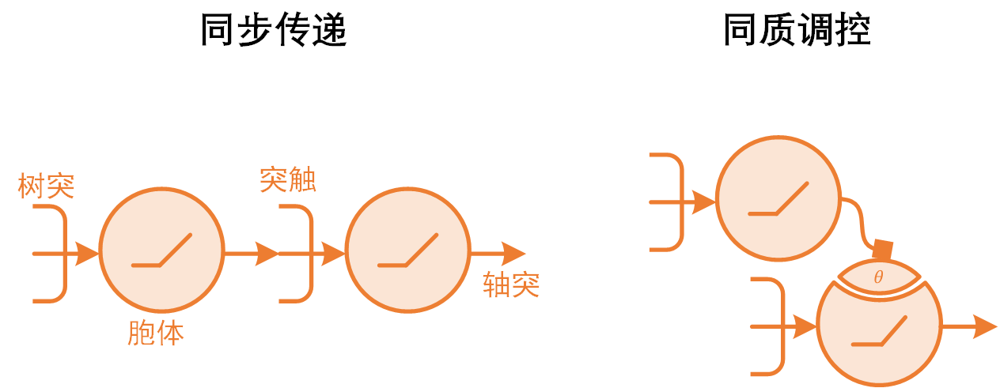
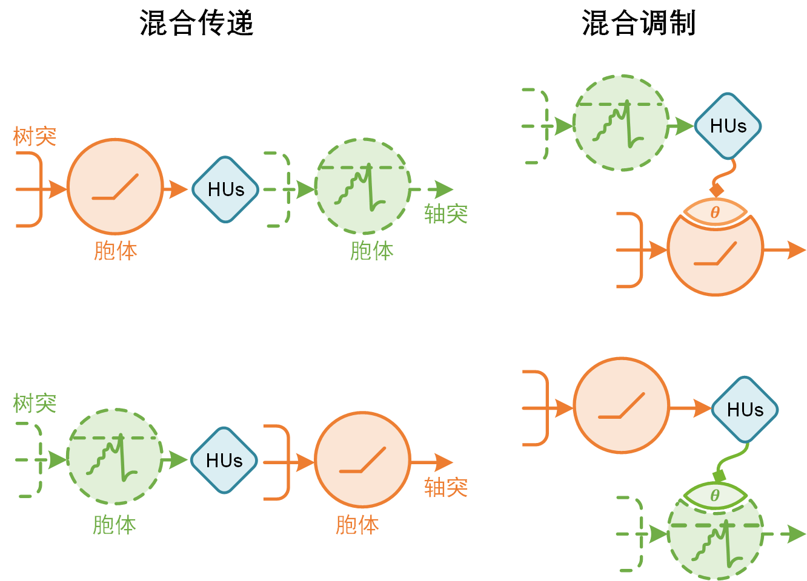
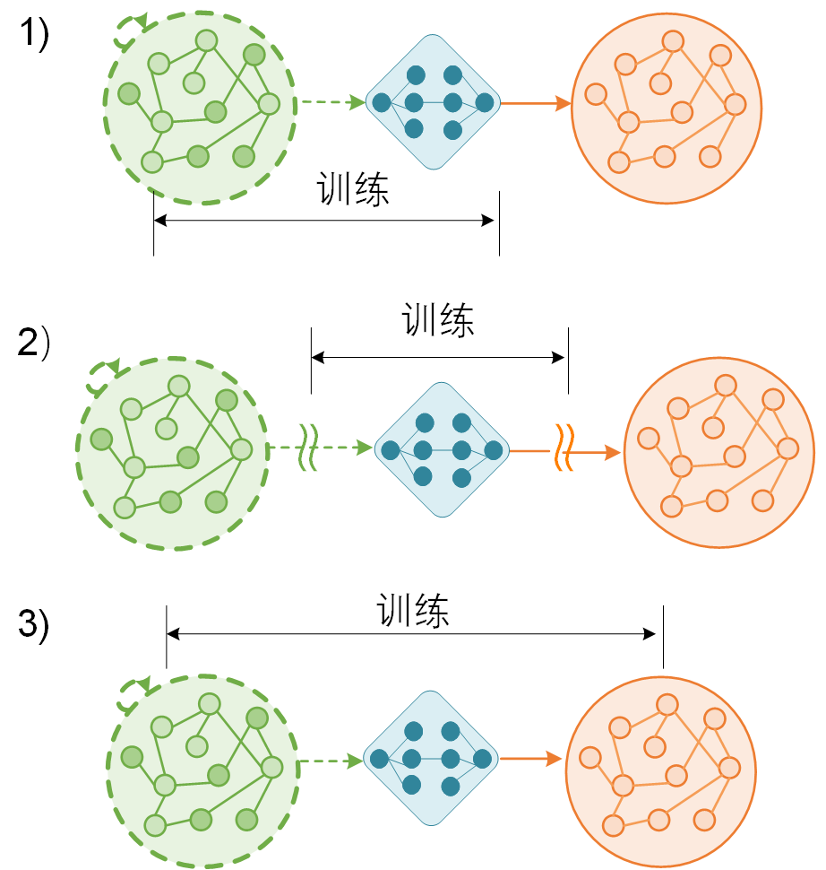

========================================================================
HNN介绍
========================================================================

本文档作者：刘发强、曲环宇

本文档分为HNN框架和HNN转换接口两部分来对HNN进行基本介绍，对HNN更加深入的介绍详见 [1]_ 。整体上讲，HNN可以分成三部分：ANN网络、SNN网络和将解耦合的ANN和SNN网络联系在一起的转换接口 -- Hybrid Unit (HU)，HU的设计又可以分成根据专家知识手动设计和自适应学习HU两大类。

HNN框架
######################

HNN框架这部分主要介绍ANN和SNN不同的神经元以及两种网络中不同的信息表示。

基本神经元模型
************************

ANN神经元模型
------------------------

ANN神经元模型不具有时间上的动力学，神经元的输入输出一般都为实数，基本模型可以表示为：

.. math::

   y = f( \mathbf{w} \cdot \mathbf{x} + b)

其中\ :math:`f(x)`\ 为激活函数，一般为非线性函数，例如ReLU。

SNN神经元模型
------------------------

SNN神经元模型具有时间上的动力学，一般通过微分方程来对SNN神经元进行建模，神经元的输入输出一般为脉冲序列，其基本模型可以表示为（参考SpikingJelly [2]_ ）：

.. math::
   u(t) & = \mathbf{w} \cdot \mathbf{s(t - 1)} + b \\
   v(t) & = f(v(t - 1), u(t)) \\
   s(t) & = \Theta(v(t) - v_{threshold})

其中\ :math:`u(t)`\ 表示当前时刻的输入，\ :math:`v(t)`\ 代表当前时刻的膜电位，为前一时刻的膜电位和当前时刻输入的函数，\ :math:`s(t)`\ 代表当前时刻脉冲神经元的输出，其中

.. math::
   \Theta(x) =
   \begin{cases}
   1, & x \geq 0 \\
   0, & x < 0
   \end{cases}

表示如果当前时刻膜电位高于阈值则发放脉冲，反之则不发放脉冲，如果神经元发放脉冲则神经元的膜电位会被重置。

在HNN网络中，为了保证ANN神经元与SNN神经元的解耦，引入了HU来作为ANN神经元与SNN神经元之间的转换接口，HU将在文档的第二部分具体介绍。

信号表示
***********************

根据上一小节对ANN神经元和SNN神经元模型的介绍，我们可以总结得到：其中ANN神经元中是同步的、连续的信号，ANN中的信号为实数域表示，而SNN神经元中是异步的、离散的信号，SNN中的信号为脉冲表示。

我们将信息流分成两种：直接的传递和间接的调制，如下图所示：

其中传递代表神经元之间通过突触传递的信息来直接影响神经元的状态，调制代表某个或某些神经元通过调整神经元或突触参数来间接影响其他神经元的状态，例如改变神经元阈值和突触权重等。在ANN和SNN中，信息的传递和调制都是在同质的信号之间发生。

在HNN中，我们通过HU来对两种异质的信号进行转换，信息流可以分成混合传递和混合调制两种，其中每种信息流又可以进一步分成ANN到SNN信号转换和SNN到ANN信号转换两种，如下图所示：

图中的实线代表ANN，虚线代表SNN。

HNN转换接口 -- Hybrid Unit
########################################

由于HU将ANN和SNN相互解耦，所以HNN中的ANN和SNN部分和常见的ANN、SNN相同，这一部分文档介绍HNN中的转换接口，Hybrid Unit。

基本操作
**********************

HU在整体上可以分成4个计算步骤：truncating (\ :math:`W(t)`\)，filtering (\ :math:`H(t)`\), non-linearity (\ :math:`F`\)和discretization (\ :math:`Q`\)。假设输入原始数据为\ :math:`X`\ ，输入数据为\ :math:`Y`\ ，HU可以表示为：

.. math::
   Y & = HU[X] \\
     & = Q \cdot F \cdot H \cdot W(X)

其中：（这部分感觉写的不是很清楚）

- **truncating:** 由于HU的输入和输出是两个没有时间上的依赖关系的时间序列，所以需要一个参数化的窗函数来同步HU的输入和输出的时间尺度，窗函数\ :math:`W(t, k, T_s)`\ 对输入\ :math:`X`\ 进行截取，其中\ :math:`T_s`\ 为时间窗长度。此步骤的输出为\ :math:`X \cdot W(t, k, T_s)`\ 。
- **filtering:** 通过kernel函数\ :math:`H(t))`\ 对 \ :math:`X \cdot W(t, k, T_s)`\ 进行时域上的卷积。
- **non-linearity:** 代表对上一步卷积得到的结果进行非线性变换。
- **discretization:** 代表离散化操作，例如将连续信号转换成SNN中的脉冲序列，为可选操作。

配置方式
**********************

与传统的信号转换相比，HU是可配置的，例如HU中的kernel函数\ :math:`H(t)`\ 和非线性函数\ :math:`F`\ 都是参数化的。

HU有两种配置方式：手动设计和自动学习。当HU的输入和输出之间的关系是确定的、简单并且已知的情况下，可以采用手动设计的方式来配置HU。在更加复杂的情况下，可以通过自动学习来对HU进行配置，HU可以通过下图中的3种方式进行学习：

1. 与前端或后端网络和在一起进行训练。
2. 通过设定特殊的优化目标来单独训练。
3. 和整个网络一起训练。

--------------------

.. [1] `A framework for the general design and computation of hybrid neural networks <https://doi.org/10.1038/s41467-022-30964-7>`__
.. [2] `SpikingJelly <https://spikingjelly.readthedocs.io/zh_CN/latest/>`__