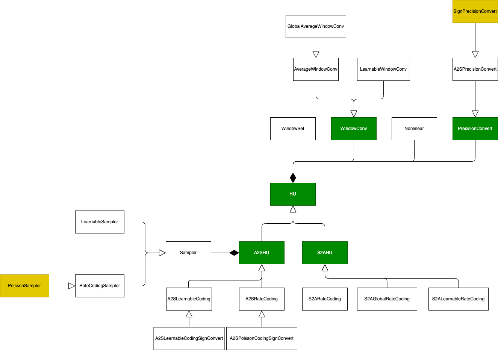

========================================================================
HNN编程与量化框架
========================================================================

本文档作者：曲环宇

HNN框架包括基本的HNN编程框架和HNN量化框架，其中量化框架在不置于量化模式时的功能等同于编程框架。

HNN编程
######################

和ANN、SNN相比，HNN编程框架主要提供了可扩展的Hybrid Unit的实现，通过Hybrid Unit可以实现ANN到SNN或SNN到ANN的转换，进而构建起HNN模型。

Hybrid Unit's UML
************************

HU整体上可以分成两类：A2SHU和S2AHU，其中A2SHU由Sampler，Nonlinear和PrecisionConvert组成，S2AHU由WindowSet，WindowConv和Nonlinear组成。

在A2SHU中，Sampler负责将ANN输出的连续值采样到多个时间步，Nonlinear对得到的中间结果进行一次非线性变换，最后Precision Convert将非线性变换后的结果转换成多个时间步上的脉冲值；在S2AHU中，WindowSet用于对SNN输出的脉冲设置时间窗，然后由WindowConv在时间窗内进行时域上的卷积，得到的结果再经过Nonlinear的非线性变换后即为ANN的输入。

每个类的介绍待补充。

HNN编程框架使用
***********************

通过HU将ANN转换到SNN

.. code:: python

   import torch
   from snn import LIF
   from hybrid_unit import A2SPoissonCodingSignConvert

   class A2SHNN(torch.nn.Module):
      def __init__(self, T):
         super(A2SHNN, self).__init__(time_window_size=T)
         self.conv1 = torch.nn.Conv2d(in_channels=1, out_channels=6,
                                      kernel_size=5, stride=1, padding=2, bias=False)
         self.maxpool1 = torch.nn.MaxPool2d(kernel_size=2, stride=2)
         self.conv2 = torch.nn.Conv2d(in_channels=6, out_channels=16,
                             kernel_size=5, stride=1, padding=0, bias=False)
         self.maxpool2 = torch.nn.MaxPool2d(kernel_size=2, stride=2)
         self.a2shu = A2SPoissonCodingSignConvert(window_size=T, non_linear=torch.nn.ReLU())
         self.linear1 = torch.nn.Linear(in_features=400, out_features=10)
         self.lif1 = LIF(v_th=1, v_leaky_alpha=0.9,
                         v_leaky_beta=0, v_reset=0)

      def forward(self, x: torch.Tensor):
         x = self.conv1(x)
         x = self.maxpool1(x)
         x = self.conv2(x)
         x = self.maxpool2(x)
         # A2SHU
         x = self.a2shu(x)  # [N, C, H, W] -> [N, C, H, W, T]
         spike = torch.zeros((self.T, x.size(0), 10))
         x = x.permute(4, 0, 1, 2, 3)  # [T, N, C, H, W]
         input = x.view(x.size(0), x.size(1), -1)  # [T, N, C * H * W]
         v1 = None
         v2 = None
         v3 = None
         for i in range(self.T):
               x = self.linear1(input[i])
               out, v1 = self.lif1(x, v1)
               x = self.linear2(out)
               out, v2 = self.lif2(x, v2)
               x = self.linear3(out)
               out, v3 = self.lif3(x, v3)
               spike[i] = out
         return spike.mean(dim=0)

通过HU将SNN转换到ANN

.. code:: python

   import torch
   from snn import LIF
   from hybrid_unit import S2AGlobalRateCoding
   

   class S2AHU(torch.nn.Module):
      def __init__(self, T):
         super(S2AHU, self).__init__(time_window_size=T)
         self.conv1 = torch.nn.Conv2d(in_channels=1, out_channels=6,
                                      kernel_size=5, stride=1, padding=2, bias=False)
         self.lif1 = LIF(v_th=1, v_leaky_alpha=0.9,
                         v_leaky_beta=0, v_reset=0)
         self.maxpool1 = torch.nn.MaxPool2d(kernel_size=2, stride=2)
         self.conv2 = torch.nn.Conv2d(in_channels=6, out_channels=16,
                                      kernel_size=5, stride=1, padding=0, bias=False)
         self.lif2 = LIF(v_th=1, v_leaky_alpha=0.9,
                         v_leaky_beta=0, v_reset=0)
         self.maxpool2 = torch.nn.MaxPool2d(kernel_size=2, stride=2)
         self.s2ahu = S2AGlobalRateCoding(window_size=T, non_linear=torch.nn.ReLU())
         self.linear1 = torch.nn.Linear(in_features=400, out_features=10)

      def forward(self, x: torch.Tensor):
         # [N, C, H ,W]
         inputs = x.unsqueeze(0).repeat(self.T, 1, 1, 1, 1)
         spike = torch.zeros((x.size(0), 16, 5, 5, self.T))
         v1 = None
         v2 = None
         for i in range(self.T):
               x = self.conv1(inputs[i])
               out, v1 = self.lif1(x, v1)
               out = self.maxpool1(out)
               x = self.conv2(out)
               out, v2 = self.lif2(x, v2)
               out = self.maxpool2(out)
               spike[..., i] = out
         # S2AHU
         x = self.s2ahu(spike)
         x = self.linear1(x)
         return x

HNN量化
########################################

待补充