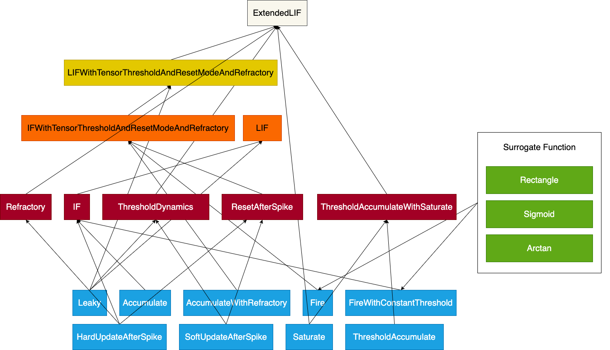
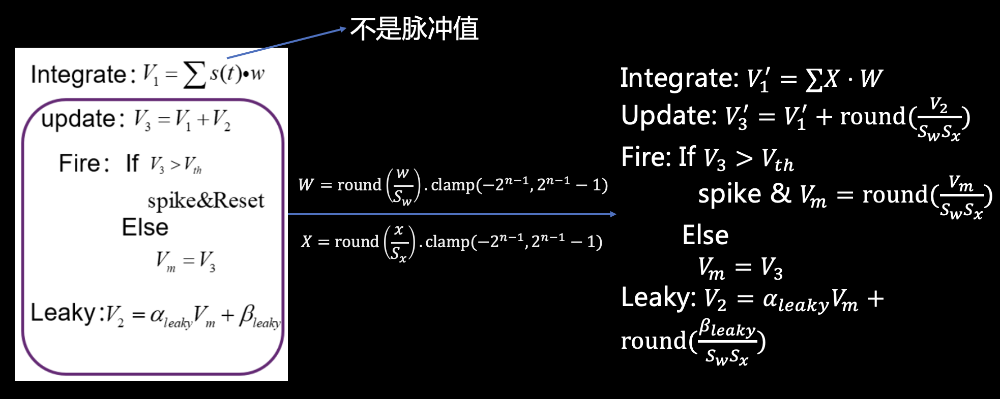

========================================================================
SNN编程与量化框架
========================================================================

本文档作者：曲环宇

SNN框架包括基本的SNN编程框架和SNN量化框架，其中量化框架在不置于量化模式时的功能等同于编程框架。

SNN编程
######################

下图为SNN编程框架的组成，最底层为编程框架提供的一系列基本操作，这些基本操作可以组成更复杂的二级操作，其中Refractory虽然包含其他基本操作，但本身具有特别的功能，所以也可以视为基本操作。二级操作中包括如复位和阈值等基本的动力学，同时也已经可以组成出IF这样基本的神经元。二级操作可以进一步组成更高级的操作，例如LIF等神经元级操作，整个SNN编程框架的最大集是Extended LIF神经元。

每个基本操作的功能和Extended LIF整体的介绍待补充。

SNN量化
########################################

SNN量化原理
*******************

脉冲化输入层量化
------------------

.. image::  _static/spike_input_snn.png
   :width: 100%
   :align: center

左图展示了基本的SNN操作在浮点数形式下的计算，当SNN层的输入为脉冲化输入时，并不需要对输入进行量化，只需要对权重进行量化。当权重以线性方式进行映射时，需要对输入的初始膜电位、阈值、复位值和膜电位泄漏时的偏置值应用相同的线性映射，保证量化后的整个神经元计算流程和浮点数的计算是近似等价的。

编码层量化
------------------

在现在的SNN网络中，常用第一个SNN层当作可学习的编码层将浮点数的输入编码成脉冲化的输入然后用于后续的SNN网络进行处理。此时integrate步骤处理的不是脉冲化输入，则需要对输入和权重同时进行量化，然后再根据输入和权重对应的量化参数对输入的初始膜电位、阈值、复位值和膜电位泄漏时的偏置值进行量化。

由于输入的量化参数需要在训练集上进行统计才能得到，整体上的量化步骤如下：

1. 训练浮点数模型
2. 统计量化参数
3. 进行量化
4. 对量化模型进行测试

SNN量化框架实现
***********************

待补充

SNN量化框架基本使用流程
************************************

1. 编写类似于下面的SNN模型：

.. code:: python

   import QModel, QLinear, QLIF

   class SNN(QModel):
      def __init__(self):
         super(SNN, self).__init__()
         self.linear = QLinear(28 * 28, 10, bias=False)
         self.lif = QLIF(v_th_0=1, v_leaky_alpha=0.5, v_leaky_beta=0, v_reset=0)

      def forward(self, x: torch.Tensor, v: torch.Tensor=None):
         x = x.view(x.size(0), -1)
         x, q_param = self.linear(x)
         out, v = self.lif(x, q_param, v)
         return out, v

2. 在当前状态下进行浮点数模型的训练

3. 将模型中的Conv-BN融合成一个卷积计算

4. 如果SNN中包含浮点数输入的编码层，则首先调用\ ``QModel``\ 中的\ ``collect_q_params()``\ 方法将模型置于待统计量化参数的状态，否则跳至7

5. 将SNN在给定数据集上进行推理，推理过程中会自动完成统计量化参数的工作

6. 调用\ ``QModel``\ 中的\ ``calculate_q_params()``\ 方法计算出用于量化的量化参数

7. 调用\ ``quantize()``\ 方法将\ ``QModel``\ 置于量化模式，\ ``quantize()``\ 方法会调用\ ``QModel``\ 的所有实例化\ ``QModule``\ 的属性的\ ``quantize()``\ 方法

8. 对\ ``QModel``\ 进行正常的前向推理，得到静态量化的测试精度；前向推理时不需要对输入进行量化

9.  调用\ ``save_quantized_model(checkpoint_path)``\ 方法保存量化模型（模型和量化参数会被保存到同一个文件）